<h1>Authing: Connect Every Person and App on the Planet</h1>

  

  
  
  
  

 

Authing quickly implements authentication and user management for any Web, App, and enterprise software to provide the most complete login solution for your customers and employees.

Authing does two things for you:

- <strong>Customer Identity</strong>

  Create a secure and seamless authentication experience for your customers.

- <strong>Workforce Identity</strong>

  Protect and enable your workforce to use any technology on any device.

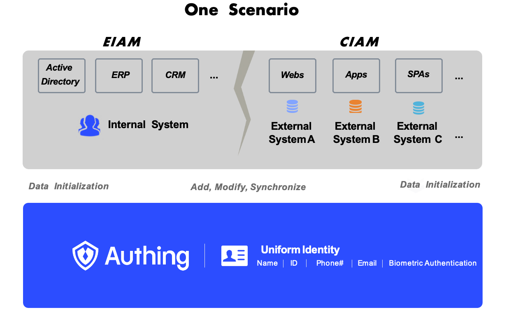

## What is Authing?

Authing serves as an identity infrastructure, or <strong>Identity As A Service (IDaaS)</strong>  for cloud computing.

Authing focuses on identity and building social infrastructure for identity sharing across all SaaS software and users to help companies build a secure modern IT infrastructure that not only protects their business, but also redefines the user experience.

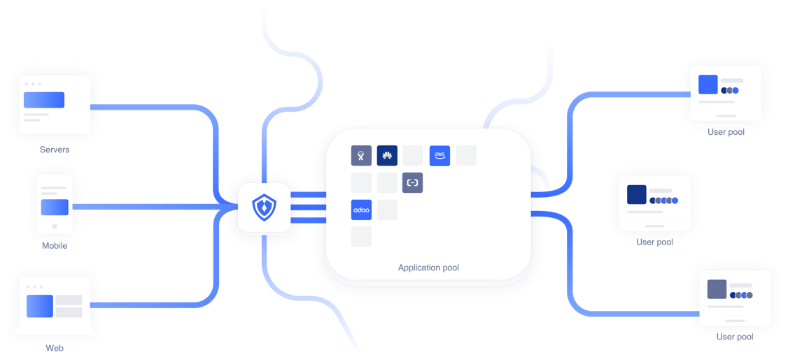

<strong><i>Infrastructure for identity sharing across all SaaS software and users</i></strong>

 

Authing is the foundation for secure connections between a complex identity ecology and an application ecology in which countless identities access applications and resources in a borderless way.

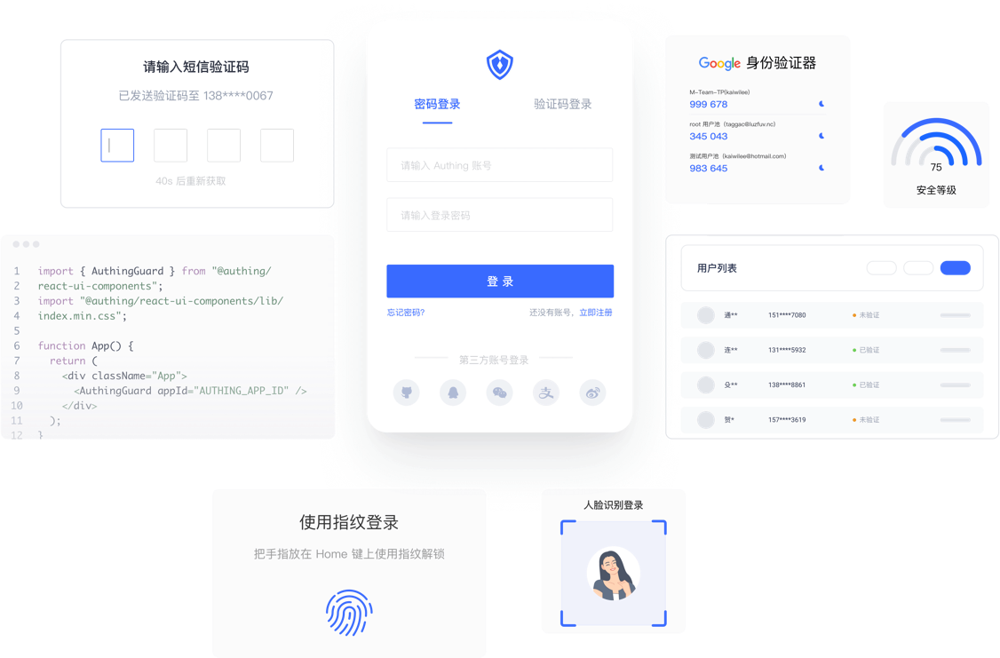

<strong><i>Key functions: Multi-factor login</i></strong>

## API First

Authing taking "API first" as the product cornerstone, all commonly used functions in the identity field are modularized and all capabilities are provided to developers through the full scene programming language SDK. At the same time, users can flexibly use Authing's Open Restful APIs for function expansion to meet the identity management needs of different enterprises under different business scenarios.

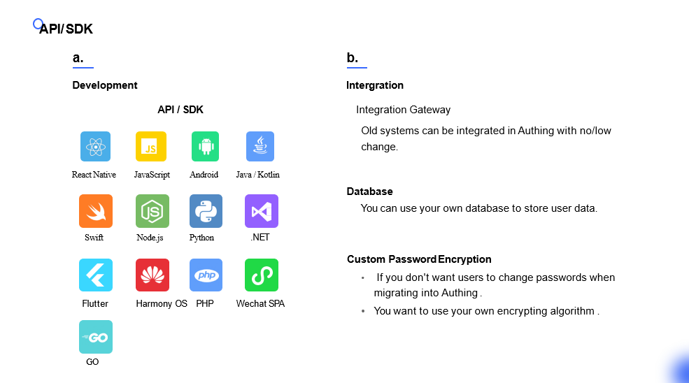

## Features and Advantages

Authing makes identity management easy.

As an excellent provider of identity management solutions, Authing will bring significant competitive advantages to enterprises in B2B, B2C, B2E or IoT scenarios: reducing development costs, improving security, and boosting production efficiency.

### High security

When Authing was launched, it was selected by the China Academy of Information and Communications Technology as an "Innovative Enterprise in the Field of Identity Management and Access Control in China" and was included in the "White Paper on Cyber ​​Security Industry 2019".

- Visual security audits

- Multi-factor login

- Password management

- Encrypted transmission and storage

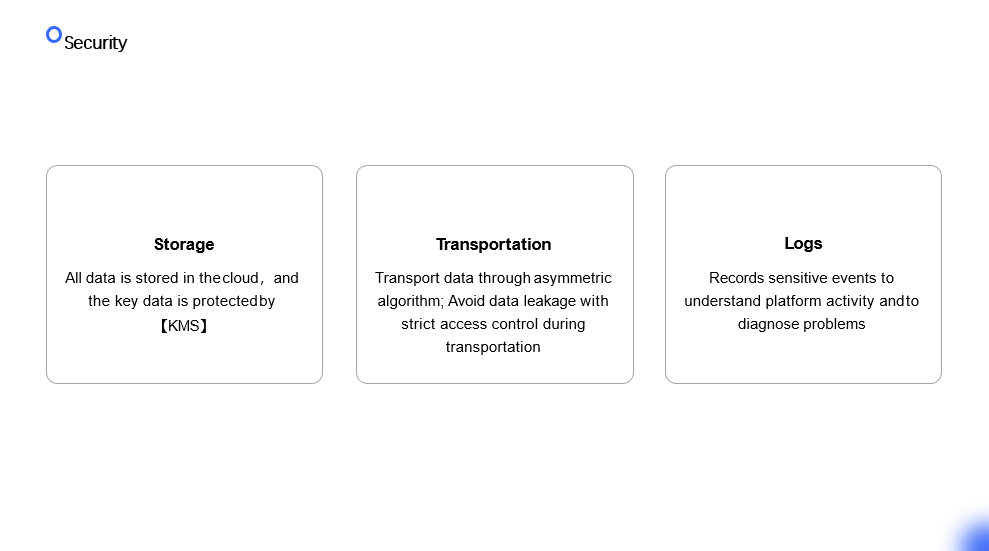

### Compliance

Authing adheres to the compliance requirements of different countries and industries and strives to create reliable services for customers. At the same time, it actively participates in the formulation and promotion of industry security standards, adheres to the principle that compliance is service, and builds and operates a safe and reliable cloud ecological environment.

	

		<strong>Click to see specific protocols Authing adapts to</strong>
	

	

    
  

As an enterprise-level SaaS service and identity service provider that concerns the core secrets of enterprises, Authing always puts security in the first place. Authing has international authoritative security certification and a mature information security management system to secure the whole life cycle of software, with reliable data security protection and round-the-clock security emergency response measures.

ISO Quality System Certification

  

ISO 9001 quality system certification is the foundation of enterprise development and growth. Authing's acquisition of this certification is a full affirmation of our long-term work in the construction of a privacy compliance system. The Authing security team has been committed to protecting user privacy and data security and providing users with transparent, efficient, safe and reliable services.

GDPR General Data Protection Regulation

  

The General Data Protection Regulation, referred to as GDPR, is a regulation of the European Union. The predecessor was the "Computer Data Protection Law" formulated by the European Union in 1995. Authing’s data center, management system, R&D, and functional departments have passed this certification, which means that we have been benchmarked with international standards in the field of information security management, have sufficient information security risk identification and control capabilities, and can provide global customers with safe and reliable service.

Authing was included in White Paper on China Cyber Security Industry.

  

When Authing was first launched, it was selected as an "Innovative Enterprise in Domestic Identity Management and Access Control" by the China Institute of Information and Communications Technology (CIIT) and was included in White Paper on China Cyber Security Industry (2019).

Three levels of protection

Ministry of Public Security Information Security Level 3 Certification GB/T 22239-2008 Information Security Technology Information System. The Basic Requirements for Security Level Protection, referred to as Security Level Protection, is an information security standard issued by the Standardization Administration of China. It is a basic system of information security in China. The level is divided into 1 to 5 levels according to the importance of the information system from low to high, and different security levels implement different protection strategies and requirements. 

Authing uses Level 3 information system protection strategy that has been successfully evaluated by a professional evaluation organization. signifies that we have security protection capabilities recognized by the authority in terms of physical, network, host, application and data. And it reached a high level in the industry.

### Cover all Wechat using scenario

Authing provides a concise and unified SDK for users in the complex login scenes for WeChat ecosystem. The backend could be automatically processed by three parts -- OpenID, UnionID and mobile phone numbers, to identify the same ID and merge the same accounts. Users only need to call the front-end SDK without worrying about various complex identification logic.

### High performance

- Millisecond query record
- Millisecond write speed
- Redundant architecture, redundant storage
- No single point of failure, high reliability
- One-click replication of architecture to public cloud / private cloud / private cloud
- One-click expansion
- Visual management tools

### High productivity

- Millisecond query record.
- RESTful, GraphQL, SDK.
- Interactive, User-Centered, Comprehensive documentation.
- Support OAuth 2.0, OIDC, SAML, AD/LDAP, WS-Fed.
- User growth, permission control, SQL or code level data query, log, audit.
- Plugin, pipeline, domain name, unlimited custom login box (style / layout), multi-database compatibility.
- Volume deployment, automatic update.

### No supplier lock-in

Authing provides a complete and easy data export feature that allows users to completely migrate their data from the platform at any time. Authing does not retain any of the data of users.
- Authing supports all major protocols in the market such as OIDC, SAML, OAuth, etc., so customers are free to choose.
- Authing supports a custom authentication process (Pipeline) . Customers can change the authentication process, plug and unplug the required functions, such as the invitation code

### Support for private deployments

Authing can provide customized private deployment solutions according to the needs of the enterprise to make identity management easier. Professional technicians are involved throughout the entire process of deploying the solution and providing full customer service after the sale.

### Customer success service

Authing supports customization and private deployment. Our team will follow up the whole process of customizing business requirements and deploy local servers for enterprise data security and control. The Customer Success team provides 7*24 hours continuous service from interface interfacing, testing and go-live to later system operation and maintenance, and management platform usage.

## Major Functions

	

		<strong>Universal login component</strong>
	

   
The Universal Directory (Guard) is an embeddable login form that can be configured according to your needs and easily add various social login methods, allowing users to log in seamlessly and have a consistent login experience on different platforms.

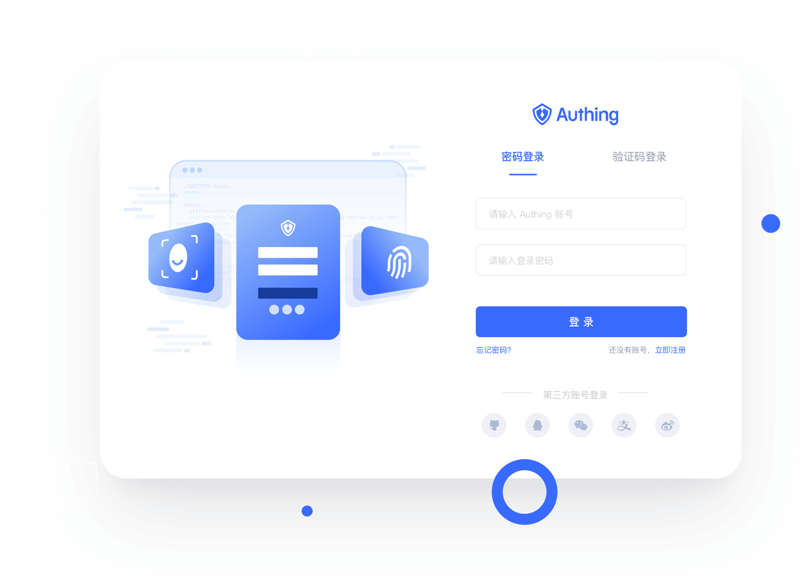

<strong><i>Universal Directory</i></strong>

The Guard helps developers shield the details of the underlying authentication and tedious UI development. It enables enterprises and developers to quickly launch a secure, customizable UI unified login form.

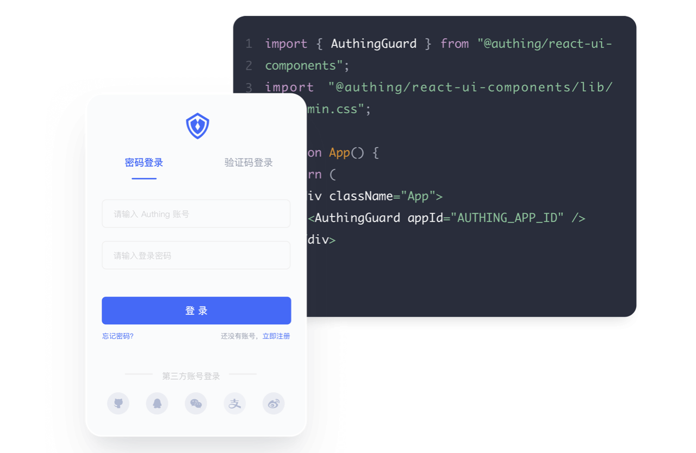

<strong><i>Developers to quickly launch a secure, customizable UI unified login form</i></strong>

- Account password / phone verification / APP scan code / corporate identity source / social login.
- Built-in interactive UI for forgetting the password, MFA function, users do not need to write any additional code to complete tasks.
- Perfectly compatible with mobile and PC, you can easily customize the login box style with CSS.
- Including login components such as React, Vue, Angular, JavaScript, etc.

Guard can be easily embedded in your apps, customized to enable multiple social providers, and designed according to your brand.
  

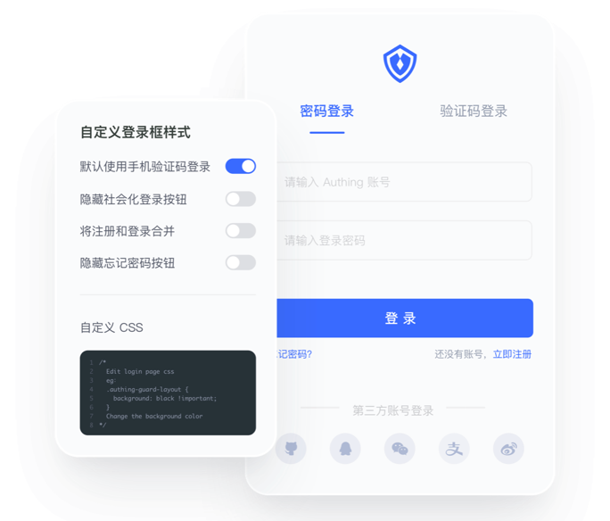

<strong><i>Flexibly define login</i></strong>

 

If you want to be able to make changes to the existing UI, you can customize it with HTML, CSS and JavaScript.

### MFA: Hign security login 

MFA is one of the best ways to prevent account theft. If a hacker wants to hack into an account protected by MFA, not only need to steal the credentials, but also need to verify additional factors.

Generally, we see a tendency to use MFA in industries dealing with sensitive data. There is no additional identity layer in these verticals, so there is an urgent need for MFA.
  

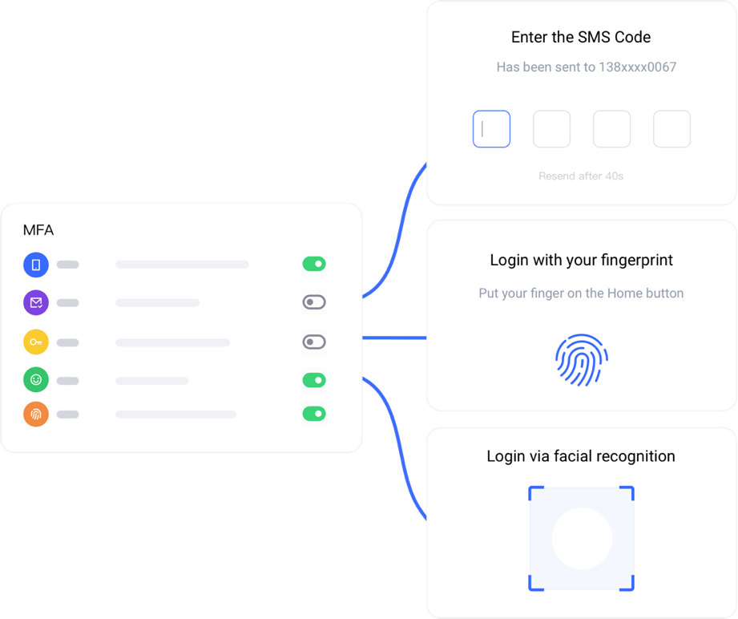

<strong><i>Authing MFA</i></strong>

 

Authing can centrally configure a variety of authentication factors other than passwords, including dynamic tokens, faces, fingerprints and other biological characteristics. At the same time, it provides a developer API to support other applications to use IDaaS's identity authentication capabilities.

### Custom Database Connections

When you want to ensure data security or smoothly migrate users, please use Authing to customize database connections. You can connect to external or local databases maintained by yourself, and you can also migrate existing user data from the old system to Authing.
  

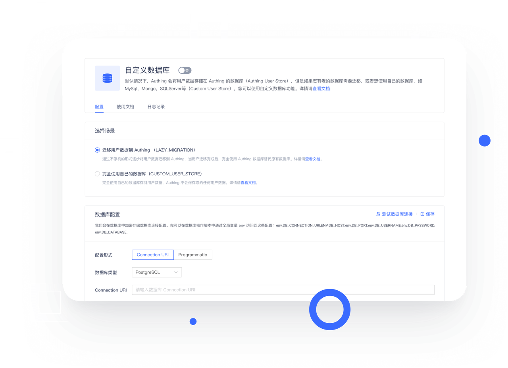

<strong><i>Custom Database Connections</i></strong>

 

### APN: Authing Partner Network

APN (Authing Partner Network) is an cooperation network provided by Authing.
After joining APN, you will be able to experience the following functions:

- Single sign-on (SSO) capability, which means your customers will be able to log in to your application through a unified entrance and a unified account
- Make it easier for your customers to find your app, since APN will add your exposure opportunities to your potential partners
 

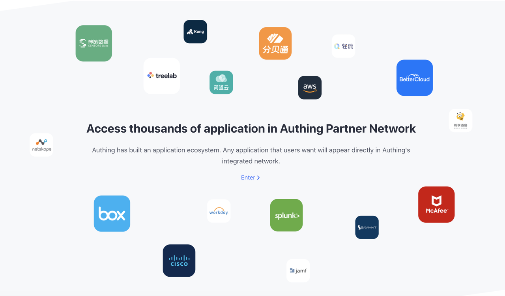

## Built-with

1. **TypeScript** - TypeScript is a superset of JavaScript that compiles to clean JavaScript output.
2. **Nest.js** - A progressive Node.js framework.
3. **React.js** - A JavaScript library for building user interfaces.
4. **PostgreSQL** - A powerful, open source object-relational database system.
5. **Kubernetes** - An open-source container orchestration system.
6. **Redis** - An open source, in-memory data structure store.
7. **RocketMQ** - A distributed messaging and streaming platform.

## Start with

To start with, Chinese users please visit [docs.authing.cn](https://docs.authing.cn)

For English users, click [https://www.authing.cn/developer](https://www.authing.cn/developer)

## Values

IDaaS is an abbreviation of Identity As a Service. Contains all functions of traditional IAM and can bring more benefits to companies: enhance marketing and operational efficiency; Accelerate new business online; enhance safety to reduce network attack risks; enhance user experience.

### Operation capacity

The traditional IAM account center has weak operational capabilities, difficult to meet large organizations in business, while IDaaS's multi-tenant operation platform and automation workflow (Workflow) can easily enhance corporate operation efficiency.

### Advocacy and scalability

When the number of users continues to rise, the pressure on the user system will continue to increase. The IDaaS of origin cloud can solve this problem, using the Authing IDaaS as an example, with nearly 10 million users per month logging into thousands of systems, with large-scale data processing experience, the digital identity solution built can better support enterprise expansion.

## Articles

### Founders

- [创·问 ｜Authing谢扬：身份是所有数字化的根本](https://mp.weixin.qq.com/s/-e5nHTi1OrCoHb-L7CJNpg)
- [Authing 李宇航：国内首款以开发者为中心的全场景身份云](https://mp.weixin.qq.com/s/GkHaGga5nUhH5-MKh2m3LA)
- [深度 | Authing CTO 尚斯年：云时代下的数字身份自动化](https://mp.weixin.qq.com/s/uRrda6HT3YvL6ZxyFmv5FA)

### Business

- [身份云平台 Authing 完成 2300 万美元 A 轮融资](https://mp.weixin.qq.com/s/ywxXUqxHh6c3eY1zlNvx3g)
- [Authing 入选福布斯亚洲“最值得关注公司”百强](https://forum.authing.cn/t/topic/381)

### Philosophy

- [QCon 演讲实录丨带你了解 Authing 背后的计算哲学](https://mp.weixin.qq.com/s/Cmfh_vrteS56SyThmsaq0g)
- [Authing 背后的计算哲学](https://mp.weixin.qq.com/s/KABe5cX-3eW1YmZVxSLTFg)
- [基于语义化思想的全新编程模型](https://gitee.com/authing/android_guard/blob/master/doc/topics/design.md)
- [让互联网重新互联 —— 从身份开始](https://mp.weixin.qq.com/s/QWw_Ex0I-LgOoKpZnWj16A)
- [Web 的未来，语义互联已死，请拥抱自由编辑](https://mp.weixin.qq.com/s?__biz=MzU1OTk1NjU4MA==&mid=2247492908&idx=1&sn=69a426b46496bfbeee238bf453545173&source=41#wechat_redirect)

### Insights

- [Authing 云端单点登录技术，助力 SaaS 企业轻松上阵加速业务布局 ｜ 案例](https://forum.authing.cn/t/topic/388)
- [Authing 社区好文推荐：如何 15 分钟开发一个很棒的登录系统](https://forum.authing.cn/t/topic/387)
- [万字长文！深度剖析身份验证的工作原理（建议收藏）](https://forum.authing.cn/t/topic/386)
- [「开发者投稿」使用 Authing 对 SPA 应用进行身份认证实践 (qq.com)](https://mp.weixin.qq.com/s/BjFv34jviPKeUtpkrMbsxg)
- [使用 Authing 替代 Cognito 结合 API 网关和 Lambda 访问资源](https://mp.weixin.qq.com/s/8oVG7ZWCjooueQEfzVGMXg)

## Who uses Authing ?
  

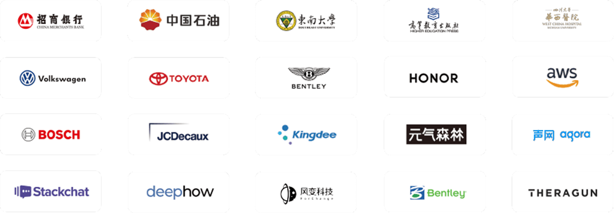

## Community

Chat freely and give us feedback on our forum: [https://forum.authing.cn](https://forum.authing.cn)

Email us at [sales@authing.cn](sales@authing.cn), or ring us at 400-6197-031 for a thorough talk.

Other ways to contact us:

Authing Chatbot:

Wechat group QR code:
  

## Contributors

  
  
  
  
  
  
  
  
  
  
  
  
  
  
  
  
  
  
  
  
  
  
  
  
  
  
  
  
  
  

 

## License

Authing is under the <strong>MIT</strong> license. 

MIT is a license agreement as liberal as BSD. You must include the original license agreement in your distribution, regardless of whether you are publishing binary still released in source code.
